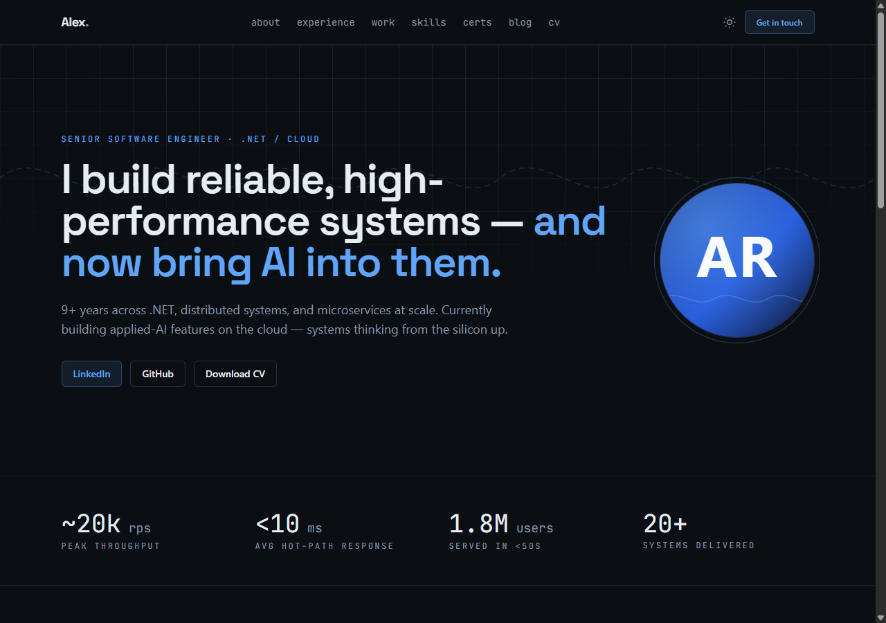
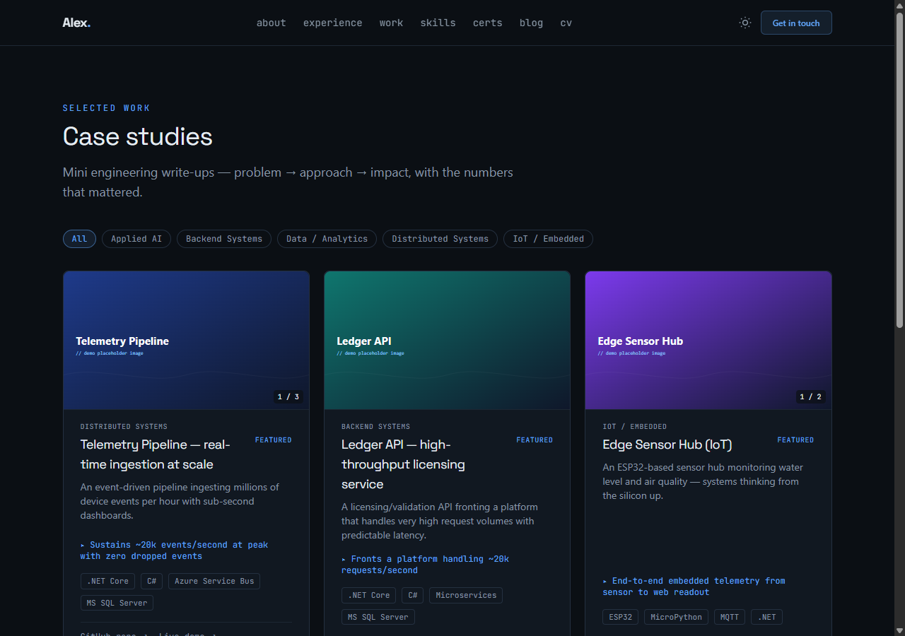

# Living CV — a database-backed portfolio template

A **portfolio & living-CV** web app built with ASP.NET Core Razor Pages, designed to double as
proof of the skills it describes. Content lives in the database (seeded from JSON) and identity
lives in configuration — so you can make it your own **without touching the code**.

It ships with a **fictional demo persona ("Alex Rivera")** so every feature is populated and
testable the moment you run it. Swap in your own details to make it yours.

<p align="center">
  
  
</p>

<p align="center">
  <a href="LICENSE"></a>
  
  
  <a href="https://github.com/hamzaultimate/living-cv/actions/workflows/ci.yml"></a>
  <a href="CONTRIBUTING.md"></a>
</p>

## Features

- Server-rendered **Razor Pages** (SEO-first) with a light/dark theme toggle
- Pages: Home, About, Experience, **Work** (case studies with image galleries + lightbox),
  Skills, **Certifications** (badge grid + branded issuer cards), **Blog** (Markdown, drafts,
  share buttons), Talks (YouTube embeds), **CV** (HTML + generated **PDF**), Contact
- `og.png` share image, `sitemap.xml`, `robots.txt`, and schema.org JSON-LD — all generated
- **Authoritative JSON seeder** — the seed files are the single source of truth; edit one,
  restart, and rows are added / updated / removed to match
- Health checks at `/health` (liveness) and `/health/db` (DB readiness)
- Zero front-end build dependencies to *run* it (Tailwind is compiled during build)

## Tech stack

| Concern | Choice |
|---|---|
| Web | ASP.NET Core **Razor Pages**, server-rendered |
| Runtime | **.NET 10 (LTS)**, publishable self-contained |
| Data | **SQL Server** via EF Core (LocalDB for local dev) |
| Styling | Tailwind CSS |
| PDF CV | QuestPDF, generated from the same data as the site |
| CI | GitHub Actions (build validation on every PR) |

## Quick start

Requires the **.NET 10 SDK** and **SQL Server LocalDB** (ships with Visual Studio, or install
SQL Server Express). The local connection string is already set in
`src/Portfolio.Web/appsettings.Development.json` and points at `(localdb)\MSSQLLocalDB`.

```bash
dotnet run --project src/Portfolio.Web
```

On first run the app **applies EF Core migrations and seeds the demo content automatically**.
Open the printed `https://localhost:xxxx` URL. Health check: `/health`.

> No database configured? The site still runs — DB-backed pages show empty states and
> `/health/db` reports the status.

## Make it yours

Everything personal lives in two places — **no code changes required**:

1. **Identity & copy** → the `"Site"` section of `src/Portfolio.Web/appsettings.json`
   (name, role, hero text, metrics, About narrative, contact links, `PhotoUrl`).
2. **Content** → the JSON files in `src/Portfolio.Data/Seed/`
   (`projects`, `experiences`, `skills`, `certifications`, `talks`, `blog`, `testimonials`).
   Each file has a header comment describing its shape.

Add images under `src/Portfolio.Web/wwwroot/img/`; set `Site:PhotoUrl` to show your photo.

## Build & publish

```bash
dotnet publish src/Portfolio.Web/Portfolio.Web.csproj -c Release \
  -r win-x64 --self-contained true -o ./publish
```

Set the production database via the `ConnectionStrings__Default` environment variable (or
`appsettings.Production.json`). **Never commit real credentials.**

## Project structure

```
src/Portfolio.Web/                ASP.NET Core Razor Pages app
  Configuration/SiteOptions.cs    Bound identity/content config ("Site" section)
  Pages/                          Razor Pages
src/Portfolio.Data/               EF Core entities, migrations, and JSON seed data
  Seed/                           Seed content (edit these to change the site)
  Seeding/PortfolioSeeder.cs      Authoritative upsert-by-natural-key seeder
docs/                             Notes and design system
```

## Contributing

Contributions are welcome! Please read [CONTRIBUTING.md](CONTRIBUTING.md) for the setup,
branching model, and coding conventions, and our [Code of Conduct](CODE_OF_CONDUCT.md).
Good first issues are labelled [`good first issue`](../../labels/good%20first%20issue).

## License

[MIT](LICENSE) — free to use, fork, and adapt.

## Maintainer

Built and maintained by [**@hamzaultimate**](https://github.com/hamzaultimate).
If this project helps you, a ⭐ is appreciated!
